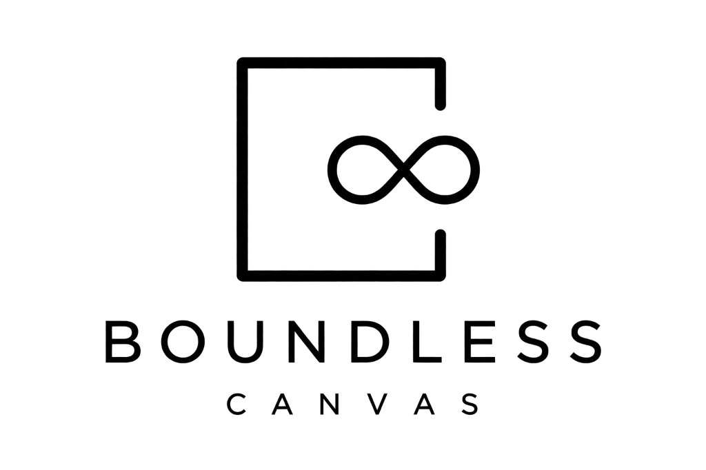

<p align="center">
  
</p>

# 🌌 Boundless Canvas

A modern, high-performance, single-page infinite 2D digital void built with **vanilla HTML5, CSS3, modern ES6+ JavaScript**, and **Firebase Modular SDK (v10+)**.

Users can pan and zoom endlessly, post anonymous sticky notes at any coordinate, watch notes decay and burn into ash over time, and see real-time ghost cursors of other connected explorers.

---

## ✨ Features

- **Infinite Camera Engine**:
  - Pan endlessly with momentum and inertia damping (`Space + Drag` or `Middle-Click Drag`).
  - Cursor-centered pinch-to-zoom and mouse wheel scaling (`0.1x` to `3.0x`).
  - High-performance frustum culling maintaining steady 60 FPS across thousands of notes.
  - Infinite dynamic dot grid and origin marker at `(0, 0)`.
- **Sticky Notes & Decay Engine**:
  - Double-click or press `N` anywhere to pin a note at exact world coordinates.
  - 6 curated pastel tones: Sunlight Yellow, Soft Rose, Fresh Mint, Sky Blue, Lavender, and Pitch Charcoal.
  - **Decay Physics**: Notes have a 24-hour lifespan. When under 25% lifetime, they visually fray, darken, and emit glowing ember and ash particles.
  - **Lifespan Extension**: Anyone can click 🔥 on any note to extend its life by **+2 hours** and add to its like counter.
- **Realtime Ghost Cursors & Presence**:
  - Ephemeral presence via Firebase Realtime Database (`presence/{userId}`).
  - Throttled cursor updates (45ms) with smooth interpolation (lerping) for jitter-free movement.
  - Random aesthetic pseudonym and color generation for every visitor.
- **HUD & Modern Glassmorphism**:
  - Minimalist floating top bar with live online count badge and live coordinate/zoom readout.
  - Bottom floating dock with quick actions (Pin, Recenter, Zoom, Share View, Help).
  - Deep-linking URL hash (`#x=...&y=...&z=...`) to share any coordinate view directly.
  - Instant toast notifications and empty space indicators.
- **Immediate Zero-Config Demo Mode**:
  - Works straight out of the box with simulated peer explorers and LocalStorage caching if Firebase keys are not yet configured!

---

## 📁 File Structure

```
boundless-canvas/
├── index.html              # HTML5 structure, HUD overlays, CDN imports
├── style.css               # Minimalist dark-mode styling & glassmorphism (blur 20px)
├── js/
│   ├── firebase-config.js  # Firebase v10 Modular SDK config & fallback handling
│   ├── canvas.js           # 2D Camera math, pan/zoom inertia, frustum culling & grid
│   ├── notes.js            # Sticky note creation, decay mechanics & particle emissions
│   ├── presence.js         # Realtime Database presence & lerped ghost cursors
│   └── app.js              # Coordinator, 60 FPS render loop & keyboard shortcuts
├── README.md               # Documentation & setup guide
└── .gitignore              # Standard gitignore
```

---

## 🚀 Quick Start

No Node.js, Webpack, or Vite build steps required! Run with any static file server:

### Using VS Code Live Server
Right-click `index.html` and select **"Open with Live Server"**.

### Using Python HTTP Server
```bash
python3 -m http.server 3000
```
Then visit `http://localhost:3000` in your browser.

---

## 🔥 Firebase Setup Guide

To enable live global multi-user persistence and real-time ghost cursor sync:

1. Create a project at [Firebase Console](https://console.firebase.google.com/).
2. Register a **Web App** and copy your project configuration.
3. Open `js/firebase-config.js` and paste your config into `firebaseConfig`.

### 1. Cloud Firestore Rules
Enable Firestore in test mode, or set the following security rules:
```javascript
rules_version = '2';
service cloud.firestore {
  match /databases/{database}/documents {
    match /notes/{noteId} {
      allow read, create: if true;
      allow update: if request.resource.data.diff(resource.data).affectedKeys().hasOnly(['likes', 'expiresAt']);
    }
  }
}
```

### 2. Realtime Database Rules
Enable Realtime Database with the following presence rules:
```json
{
  "rules": {
    "presence": {
      ".read": true,
      "$userId": {
        ".write": true
      }
    }
  }
}
```

---

## ⌨️ Controls & Shortcuts

| Action | Shortcut |
|---|---|
| **Pan Canvas** | `Space + Drag` / `Middle-Click Drag` / `Touch Drag` |
| **Zoom View** | `Mouse Wheel` / `Trackpad Pinch` / `+` / `-` |
| **Pin New Note** | `Double Click` anywhere or press <kbd>N</kbd> |
| **Commit Note** | `Ctrl + Enter` or click **Pin** |
| **Recenter Camera** | <kbd>0</kbd> or click **Recenter** |
| **Extend Lifespan (+2h)** | Click 🔥 on any note |
| **Close Editor / Modal** | <kbd>Esc</kbd> |
